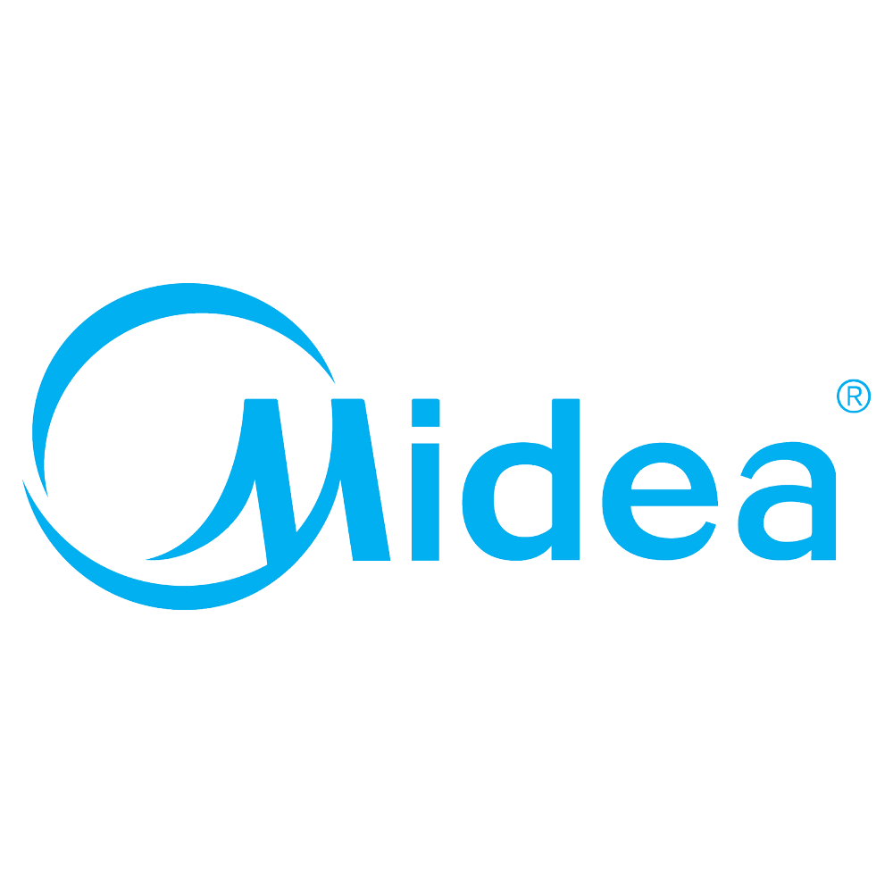
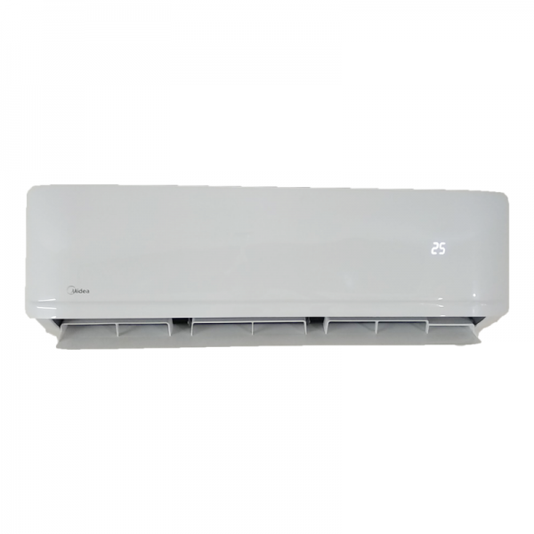
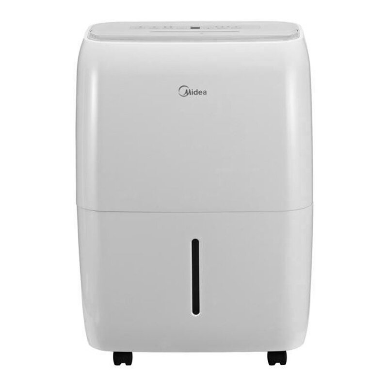

# Homebridge Midea Air

 
  

Programming is not easy.
If you like this plugin or want to contribute to future development, a donation will help.  

## [Homebridge](https://github.com/nfarina/homebridge) plugin to control Midea Air Conditioner & Dehumidifier units.

 &nbsp;

## Requirements

 &nbsp;
 &nbsp;

## Configuration

Add this to the platforms array in your config.json:

    {
        "user": "MIDEA_ACCOUNT_EMAIL",
        "password": "MIDEA_PASSWORD",
        "interval": 30,
        "devices": [
                {
                    "deviceId": "DeviceID",
                    "supportedSwingMode": "Both",
                    "fanOnlyMode": false,
                    "OutdoorTemperature": false
                }
        ],
        "platform": "midea-air"
    }

## Notes

Using the Midea app and `Homebridge Midea Air plugin` at the same time causes a login error. Try to use [NetHome Plus](https://apps.apple.com/us/app/nethome-plus/id1008001920) app instead.

## Supported Devices

This Plugin support Midea providers dongle - OSK102 / OSK103 (Hualing, Senville, Klimaire, AirCon, Century, Pridiom, Thermocore, Comfee, Alpine Home Air, Artel, Beko, Electrolux, Galactic, Idea, Inventor, Kaisai, Mitsui, Mr. Cool, Neoclima, Olimpia Splendid, Pioneer, QLIMA, Royal Clima, Qzen, Toshiba, Carrier, Goodman, Friedrich, Samsung, Kenmore, Trane, Lennox, LG, Electra and much more) and should be able to access all device in the user's account. However, many devices may not be supported or function incorrectly. This is due to the lack of documentation of the raw MSmart API. If you encounter any problems, please open a new issue and specify your device model.

## Optional per-device Configuration Values

To set specific per-device values, you need to add deviceId that can find in:

1. Homebridge console log.
2. HomeKit app, device settings, info.

### Temperature Display Units

This Plugin support Celsius & Fahrenheit (Default unit is Celcius).
Display Units can set in HomeKit app, device settings.

### Supported Swing Mode

"None", "Vertical", "Horizontal", "Both".
You have to select which type your device supports.

### Rotation Speed and Swing

Rotation Speed and Swing mode can set in the HomeKit app, device settings.
Rotation Speed values are:
| Air Conditioner | Dehumidifier |
| --- | --- |
| 0% Device off | 0% Device off |
| 25% Low | 30% Silent |
| 50% Middle | 60% Medium
| 75% High | 100% High |
| 100% Auto | ... |

### Fan Mode

This allows you to enable a Fan mode service.

### Outdoor Temperature Sensor

This allows you to enable Outdoor Temperature service, if the AC support.

## Credits

This plugin is based on the project [ttimpe/homebridge-midea](https://github.com/ttimpe/homebridge-midea) and would not have been possible without the fundamentals that the [ioBroker.midea](https://github.com/TA2k/ioBroker.midea) plugin and all of the other Midea API clients in Ruby and Python provided.
